# Hi there 👋 I'm Akkarapon Phikulsri  
<p align="left">  </p>

## 🧑‍💻 A Software Craftsman

- Passionate about exploring new technologies and building innovative solutions to solve real-world business challenges.
- Skilled across a wide range of areas including frontend and backend development, cloud deployments, and microservices architecture.
- Focused on delivering impactful, scalable, and efficient solutions.

---


<!--START_SECTION:waka-->
<!--END_SECTION:waka-->


<!--START_SECTION:waka-simple-->

```text
From: 18 August 2021 - To: 13 June 2025

Total Time: 372 hrs 20 mins

C#              100 hrs 10 mins ⣿⣿⣿⣿⣿⣿⣶⣀⣀⣀⣀⣀⣀⣀⣀⣀⣀⣀⣀⣀⣀⣀⣀⣀⣀   26.90 %
Python          44 hrs 3 mins   ⣿⣿⣿⣀⣀⣀⣀⣀⣀⣀⣀⣀⣀⣀⣀⣀⣀⣀⣀⣀⣀⣀⣀⣀⣀   11.83 %
Other           34 hrs 28 mins  ⣿⣿⣤⣀⣀⣀⣀⣀⣀⣀⣀⣀⣀⣀⣀⣀⣀⣀⣀⣀⣀⣀⣀⣀⣀   09.26 %
```

<!--END_SECTION:waka-simple-->

---

> *"Crafting software requires artistry, guided by imagination, grounded in logic, endlessly enduring."*

I thrive on challenges, constantly adapt to new technologies, and strive to contribute to impactful software solutions.

```mermaid
flowchart LR
    A[🎨 Software Craftsmanship] --> B[🎯 Expertise]
    A --> C[🛠️ Tech Stack]
    A --> D[🚀 Projects]
    
    B --> E[⚡ Performance Optimization]
    B --> F[🏗️ Scalable Architecture]
    B --> G[💡 Problem Solving]
    
    C --> H[🎨 Frontend]
    C --> I[⚙️ Backend]
    C --> J[☁️ DevOps]
    C --> K[🗄️ Database]
    
    H --> L[Next.js • Redux • TypeScript]
    I --> M[Golang • C# • Python]
    J --> N[Docker • AWS • Kubernetes]
    K --> O[PostgreSQL • MongoDB • Redis]
    
    D --> P[🌐 Web Applications]
    D --> Q[🔗 Microservices]
    D --> R[📱 Mobile Apps]
    D --> S[🤖 API Development]
    
    E --> T[📊 Monitoring & Analytics]
    F --> U[🔄 CI/CD Pipelines]
    G --> V[🧪 Testing & Quality]
    
    P --> W[💼 Business Solutions]
    Q --> X[🎯 High Availability]
    R --> Y[📱 Cross-Platform]
    S --> Z[🔗 RESTful & GraphQL]

    %% GitHub-optimized styling
    style A fill:#0969da,stroke:#0550ae,stroke-width:4px,color:#ffffff
    
    style B fill:#7c3aed,stroke:#6d28d9,stroke-width:3px,color:#ffffff
    style C fill:#059669,stroke:#047857,stroke-width:3px,color:#ffffff
    style D fill:#f59e0b,stroke:#d97706,stroke-width:3px,color:#ffffff
    
    style E fill:#8b5cf6,stroke:#7c3aed,stroke-width:2px,color:#ffffff
    style F fill:#a855f7,stroke:#9333ea,stroke-width:2px,color:#ffffff
    style G fill:#6366f1,stroke:#4f46e5,stroke-width:2px,color:#ffffff
    
    style H fill:#16a34a,stroke:#15803d,stroke-width:2px,color:#ffffff
    style I fill:#059669,stroke:#047857,stroke-width:2px,color:#ffffff
    style J fill:#0891b2,stroke:#0e7490,stroke-width:2px,color:#ffffff
    style K fill:#0d9488,stroke:#0f766e,stroke-width:2px,color:#ffffff
    
    style L fill:#22c55e,stroke:#16a34a,stroke-width:1px,color:#ffffff
    style M fill:#10b981,stroke:#059669,stroke-width:1px,color:#ffffff
    style N fill:#06b6d4,stroke:#0891b2,stroke-width:1px,color:#ffffff
    style O fill:#14b8a6,stroke:#0d9488,stroke-width:1px,color:#ffffff
    
    style P fill:#f97316,stroke:#ea580c,stroke-width:2px,color:#ffffff
    style Q fill:#f59e0b,stroke:#d97706,stroke-width:2px,color:#ffffff
    style R fill:#eab308,stroke:#ca8a04,stroke-width:2px,color:#ffffff
    style S fill:#d97706,stroke:#b45309,stroke-width:2px,color:#ffffff
    
    style T fill:#c084fc,stroke:#a855f7,stroke-width:1px,color:#ffffff
    style U fill:#d8b4fe,stroke:#c084fc,stroke-width:1px,color:#ffffff
    style V fill:#93c5fd,stroke:#3b82f6,stroke-width:1px,color:#ffffff
    
    style W fill:#fb923c,stroke:#f97316,stroke-width:1px,color:#ffffff
    style X fill:#fbbf24,stroke:#f59e0b,stroke-width:1px,color:#ffffff
    style Y fill:#facc15,stroke:#eab308,stroke-width:1px,color:#ffffff
    style Z fill:#fb7185,stroke:#f43f5e,stroke-width:1px,color:#ffffff
    
    %% Clean link styling
    linkStyle default stroke:#6b7280,stroke-width:2px
```





<h4 align="center">
Activity
</h4>
  


 <div align="center">

  <div>
    
  </div>
  

  <a href="http://www.github.com/akkaraponph"></a>
  <a href="http://www.github.com/akkaraponph"></a>

</div>


<div>

<h4 align="center">


</div>


<div align="center">


<div style="text-align: center;">
  <picture>
    <source media="(prefers-color-scheme: dark)" srcset="https://github.com/akkaraponph/akkaraponph/blob/output/github-snake-dark.svg" />
    <source media="(prefers-color-scheme: light)" srcset="https://github.com/akkaraponph/akkaraponph/blob/output/github-snake.svg" />
    
  </picture>
</div>
</div>


    
 
 


<br />


 <div align="center">

  </div>

[](https://www.digitalocean.com/?refcode=a351da331073&utm_campaign=Referral_Invite&utm_medium=Referral_Program&utm_source=badge)
<a href="https://www.buymeacoffee.com/akkarapon"></a>


---


## ♾️ Workflows

```mermaid
flowchart TD
    A[🚀 Live/Production] --> B[💻 Code]
    B --> C{🐛 Bug Found?}
    C -->|Yes| D[🔧 Fix Bug]
    C -->|No| E[✅ Deploy]
    D --> F[🔄 Restart]
    F --> G{💡 Worth Refactoring?}
    G -->|Yes| H[♻️ Refactor]
    G -->|No| I[📋 Document & Move On]
    H --> J[🧪 Test Refactored Code]
    J --> K{✓ Tests Pass?}
    K -->|Yes| E
    K -->|No| D
    E --> L[🎉 Success]
    I --> L
    L --> A
    
    %% Enhanced styling with eye-friendly colors
    style A fill:#2563eb,stroke:#1d4ed8,stroke-width:3px,color:#ffffff
    style B fill:#7c3aed,stroke:#6d28d9,stroke-width:2px,color:#ffffff
    style C fill:#0891b2,stroke:#0e7490,stroke-width:2px,color:#ffffff
    style D fill:#f59e0b,stroke:#d97706,stroke-width:2px,color:#ffffff
    style E fill:#16a34a,stroke:#15803d,stroke-width:2px,color:#ffffff
    style F fill:#06b6d4,stroke:#0891b2,stroke-width:2px,color:#ffffff
    style G fill:#8b5cf6,stroke:#7c3aed,stroke-width:2px,color:#ffffff
    style H fill:#059669,stroke:#047857,stroke-width:2px,color:#ffffff
    style I fill:#6b7280,stroke:#4b5563,stroke-width:2px,color:#ffffff
    style J fill:#a855f7,stroke:#9333ea,stroke-width:2px,color:#ffffff
    style K fill:#0d9488,stroke:#0f766e,stroke-width:2px,color:#ffffff
    style L fill:#ca8a04,stroke:#a16207,stroke-width:3px,color:#ffffff
    
    %% Link styling with softer colors
    linkStyle default stroke:#374151,stroke-width:2px
    linkStyle 0 stroke:#3b82f6,stroke-width:3px
    linkStyle 1 stroke:#06b6d4,stroke-width:2px
    linkStyle 2 stroke:#22c55e,stroke-width:2px
    linkStyle 3 stroke:#f97316,stroke-width:2px
    linkStyle 4 stroke:#06b6d4,stroke-width:2px
    linkStyle 5 stroke:#10b981,stroke-width:2px
    linkStyle 6 stroke:#6b7280,stroke-width:2px
    linkStyle 7 stroke:#059669,stroke-width:2px
    linkStyle 8 stroke:#0d9488,stroke-width:2px
    linkStyle 9 stroke:#22c55e,stroke-width:2px
    linkStyle 10 stroke:#0891b2,stroke-width:2px
    linkStyle 11 stroke:#f59e0b,stroke-width:3px
    linkStyle 12 stroke:#f59e0b,stroke-width:3px
    linkStyle 13 stroke:#3b82f6,stroke-width:3px
```




## 🛠️ Languages and Tools

### Languages
<p align="center">


</p>

### Frontend
<p align="center">


</p>

### Backend
<p align="center">


</p>

### Mobile
<p align="center">


</p>

### Databases
<p align="center">


</p>

### DevOps & Cloud
<p align="center">


</p>

### Tools & Others
<p align="center">


</p>


<br />

## 🌱 Lifeflows

```mermaid
flowchart TD
    A[😴 It was working yesterday] --> B[🔍 Read Error Message]
    B --> C{🤔 Makes Sense?}
    C -->|Yes| D[🛠️ Quick Fix]
    C -->|No| E[🦆 Rubber Duck Debug]
    D --> F{✅ Fixed?}
    F -->|Yes| G[🎉 Victory Dance]
    F -->|No| H[😤 This is impossible]
    E --> I[💡 Eureka Moment]
    I --> J[🔨 Implement Fix]
    H --> K[📚 Stack Overflow / Ask AI]
    K --> L{🎯 Found Solution?}
    L -->|Yes| M[📋 Copy and Paste]
    L -->|No| N[😢 GitHub Issues]
    M --> O{🧪 Works Now?}
    O -->|Yes| P[😅 I knew that]
    O -->|No| Q[🤯 Existential Crisis]
    N --> R[👥 Ask for Help]
    Q --> S[☕ Coffee Break]
    S --> T[🧘 Fresh Eyes]
    T --> U[🔍 Git Blame Check]
    U --> V[😈 I wrote this mess]
    V --> W[🔄 Rewrite Everything]
    J --> F
    R --> X{💬 Got Help?}
    X -->|Yes| Y[🤝 Pair Debug]
    X -->|No| Z[🌙 Sleep on It]
    Y --> F
    Z --> AA[🌅 Morning Clarity]
    AA --> B
    W --> F
    P --> G
    G --> AB[📝 Document It]
    AB --> AC[🔄 Next Bug]
    AC --> A

    %% Enhanced eye-friendly styling
    style A fill:#6366f1,stroke:#4f46e5,stroke-width:2px,color:#ffffff
    style B fill:#7c3aed,stroke:#6d28d9,stroke-width:2px,color:#ffffff
    style C fill:#0891b2,stroke:#0e7490,stroke-width:2px,color:#ffffff
    style D fill:#f59e0b,stroke:#d97706,stroke-width:2px,color:#ffffff
    style E fill:#06b6d4,stroke:#0891b2,stroke-width:2px,color:#ffffff
    style F fill:#0d9488,stroke:#0f766e,stroke-width:2px,color:#ffffff
    style G fill:#16a34a,stroke:#15803d,stroke-width:3px,color:#ffffff
    style H fill:#f97316,stroke:#ea580c,stroke-width:2px,color:#ffffff
    style I fill:#a855f7,stroke:#9333ea,stroke-width:2px,color:#ffffff
    style J fill:#059669,stroke:#047857,stroke-width:2px,color:#ffffff
    style K fill:#8b5cf6,stroke:#7c3aed,stroke-width:2px,color:#ffffff
    style L fill:#0891b2,stroke:#0e7490,stroke-width:2px,color:#ffffff
    style M fill:#6366f1,stroke:#4f46e5,stroke-width:2px,color:#ffffff
    style N fill:#64748b,stroke:#475569,stroke-width:2px,color:#ffffff
    style O fill:#0d9488,stroke:#0f766e,stroke-width:2px,color:#ffffff
    style P fill:#16a34a,stroke:#15803d,stroke-width:2px,color:#ffffff
    style Q fill:#a855f7,stroke:#9333ea,stroke-width:2px,color:#ffffff
    style R fill:#06b6d4,stroke:#0891b2,stroke-width:2px,color:#ffffff
    style S fill:#8b5cf6,stroke:#7c3aed,stroke-width:2px,color:#ffffff
    style T fill:#059669,stroke:#047857,stroke-width:2px,color:#ffffff
    style U fill:#f59e0b,stroke:#d97706,stroke-width:2px,color:#ffffff
    style V fill:#f97316,stroke:#ea580c,stroke-width:2px,color:#ffffff
    style W fill:#7c3aed,stroke:#6d28d9,stroke-width:2px,color:#ffffff
    style X fill:#0891b2,stroke:#0e7490,stroke-width:2px,color:#ffffff
    style Y fill:#16a34a,stroke:#15803d,stroke-width:2px,color:#ffffff
    style Z fill:#64748b,stroke:#475569,stroke-width:2px,color:#ffffff
    style AA fill:#06b6d4,stroke:#0891b2,stroke-width:2px,color:#ffffff
    style AB fill:#059669,stroke:#047857,stroke-width:2px,color:#ffffff
    style AC fill:#6366f1,stroke:#4f46e5,stroke-width:2px,color:#ffffff
    
    %% Link styling with soft colors
    linkStyle default stroke:#374151,stroke-width:2px
    linkStyle 0 stroke:#7c3aed,stroke-width:2px
    linkStyle 1 stroke:#0891b2,stroke-width:2px
    linkStyle 2 stroke:#f59e0b,stroke-width:2px
    linkStyle 3 stroke:#06b6d4,stroke-width:2px
    linkStyle 4 stroke:#16a34a,stroke-width:2px
    linkStyle 5 stroke:#f97316,stroke-width:2px
    linkStyle 6 stroke:#a855f7,stroke-width:2px
    linkStyle 7 stroke:#059669,stroke-width:2px
    linkStyle 8 stroke:#8b5cf6,stroke-width:2px
    linkStyle 9 stroke:#6366f1,stroke-width:2px
    linkStyle 10 stroke:#64748b,stroke-width:2px
    linkStyle 11 stroke:#0d9488,stroke-width:2px
    linkStyle 12 stroke:#16a34a,stroke-width:2px
    linkStyle 13 stroke:#a855f7,stroke-width:2px
    linkStyle 14 stroke:#06b6d4,stroke-width:2px
    linkStyle 15 stroke:#8b5cf6,stroke-width:2px
    linkStyle 16 stroke:#059669,stroke-width:2px
    linkStyle 17 stroke:#f59e0b,stroke-width:2px
    linkStyle 18 stroke:#f97316,stroke-width:2px
    linkStyle 19 stroke:#7c3aed,stroke-width:2px
    linkStyle 20 stroke:#0d9488,stroke-width:2px
    linkStyle 21 stroke:#16a34a,stroke-width:2px
    linkStyle 22 stroke:#64748b,stroke-width:2px
    linkStyle 23 stroke:#0d9488,stroke-width:2px
    linkStyle 24 stroke:#06b6d4,stroke-width:2px
    linkStyle 25 stroke:#7c3aed,stroke-width:2px
    linkStyle 26 stroke:#0d9488,stroke-width:2px
    linkStyle 27 stroke:#16a34a,stroke-width:2px
    linkStyle 28 stroke:#059669,stroke-width:2px
    linkStyle 29 stroke:#6366f1,stroke-width:2px
    linkStyle 30 stroke:#6366f1,stroke-width:2px
```



